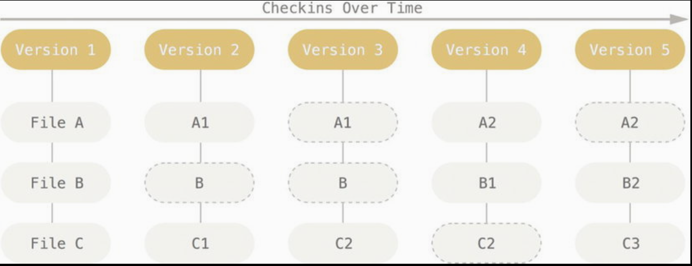
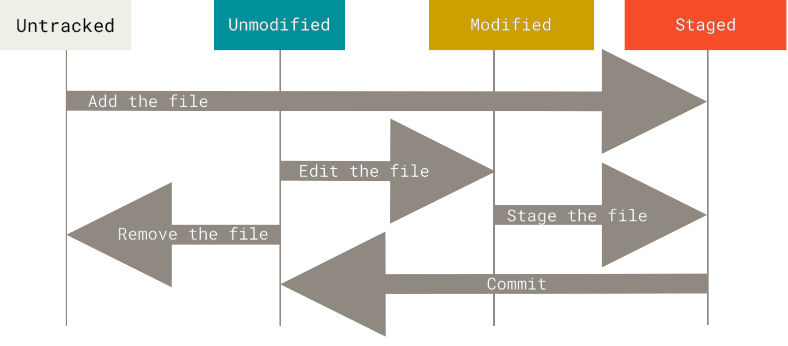

# Git basics

This short introduction explains the following key concepts that you need to
learn to benefit fully from practical exercises in this workshop:

- What version control system (VCS) is and how it evolved over time
- What Git is
- Why you should care about Git if you're a technical writer

## Version control system (VCS)

It's a tool that records changes to a file or set of files over time so that you
can recall specific versions later. For example, a VCS allows you to:

- Revert the entire project to a previous state
- Compare changes
- See who last modified something
- Analyze the history of changes to find a bug

Generally, using a VCS means that if something goes wrong, you can recover.

### Evolution of version control systems

Here's a brief history of version control systems that will allow you to
understand how Git is different from other tools of this type. Images in this
section come from the "Ry's Git Tutorial" book.

#### The "final" solution (aka files and folders)

Before a VCS was invented, the only way to track versions of a project was to
create a copy and give it a new name. Just think how many times you saved a file
or folder whose name contained the word "final" 😉 This solution was very prone
to errors, such as overwriting the wrong file or mislabelling a folder.


#### Local VCS

Because creating copies of files and folders wasn't a good solution, developers
invented local Version Control Systems. These tools stored files and folders in
a database. Instead of accessing files directly, you "checked out" a copy of the
project. This solution was a big step forward, but it didn't offer an efficient
way of sharing code among a group of programmers because everything happened
locally.


#### Centralized VCS

A centralized VCS is similar to a local VCS, but the project history is stored
on a server. You check out files and then save them back into the project over
network. This solution allows you to collaborate on a project with others
through a single point of entry. To solve the issue of creating conflicting
changes at the same time, a CVCS prevents you from overriding others' work (file
checkout, file lock). A CVCS has one more downside - it has a single point of
failure. If the server goes down or becomes corrupted, you can't do your work.
Even worse, you can lose the entire data. An example of a CVCS is Subversion.


#### Distributed Version Control System

A distributed VCS solves the issue of collaboration in a larger group. Instead
of checking out the latest snapshot of the files, you have your own local copy
of the entire project. It allows you to work independently and put off merging
conflicts until your convenience. A DVCS is also much faster because you don't
have to perform actions over a network. Also, the risk of losing data is much
lower compared to a CVCS because every user has a complete copy of the entire
project. An example of a DVCS is Git.


## Git

It's a free and open-source DVCS, which propels most of the software development
industry. When the Linux community lost their free license for BitKeeper
(commercial DVCS) in 2005, they decided to develop their own system.

This tool was built with speed, simple design and support for non-linear
development in mind. It has some unique features that make it different from
other tools of this type. Images in this section come from the "Pro Git" book
and the official Git documentation.

### Snapshots

Other VCSes, like Subversion, store information as a list of file-based changes.
In other words, these systems record only differences.


Git stores data like a set of snapshots of a filesystem. In other words, every
time you perform an operation, Git takes a picture of what all your files look
like at the moment and stores a reference to that snapshot.



### Local operations

Most actions that you perform in Git are local. You don't need another computer
or connection to a network. It has two major advantages:

1. Operations are fast
2. You can work on your project without interruptions, for example on an
   airplane or a train, and share your changes with others when you get to a
   network connection to upload.

### Checksum

To ensure integrity of changes, Git checksums everything before storing it. This
way, no changes can go under Git's radar. The mechanism used for this
checksumming is the SHA-1 hash:

- String composed of 40 hexadecimal characters (0-9 and a-f)
- Calculated based on the contents of a file or directory

Example:

```text
01bdc71d3bd5c9b9f0d6a8cdc4b1a7d35ef625c0
```

Checksumming is an important concept because Git stores everything in its
database not by filename but by the hash value of its contents.

### States

In a Git repository, a file can be in one of the following states:

1. `untracked` - Git doesn't record changes for this file
2. `unmodified` - the file wasn't changed
3. `modified` - the file was changed but wasn't staged
4. `staged` - the file was changed and its current version was marked to go into
   the next commit



These states are related to three main sections of a Git project:

1. **The `.git` directory (repository)** - it contains metadata and object
   database for your project. It's the most important part of Git. It's copied
   when you clone a repository.
2. **Working directory** - a single checkout of one version of the project.
   These files are pulled out of the compressed database in the Git directory
   and placed on your hard disk.
3. **Staging area** - a file in your Git directory that stores information about
   what will go into the next commit


The basic workflow in Git looks like this:

1. You create a new file. File state: `untracked`.
2. You add it to the Git project. File state: `staged`.
3. You commit the new file. File state: `unmodified`.
4. You change the file in your working directory. File state: `modified`.
5. You stage the file by adding its snapshot to the staging area: File state:
   `staged`.
6. You commit your changes (the file snapshot is moved from the staging area to
   the Git directory). File state: `unmodified`.

### Remote repository

It's a repository hosted on the Internet or somewhere else. It's not a
requirement of Git to have one central remote repository as the "source of
truth" but a process choice. It's hard to collaborate with others without such a
repository. Sure, you can share changes with others in a different way, for
example by creating and sending patches, but it's not a scalable solution. With
the advent of platforms like GitHub and Bitbucket, it became a convention to
have a remote repository with which everyone synchronizes their changes by
pulling and pushing them. These platforms offer additional features, such as
authentication, access control pull requests, which are useful when you work on
a project with others. It's important to know what is part of Git and what is an
extra thing on top of it added by a platform.

## Why technical writers should learn Git

### Industry standard

Many companies use Git for code and documentation. Learning Git makes you more
effective and more hireable.

### Transferable skill

Git skills apply across roles and projects documentation, content design,
product specs, and beyond.

### Great for plain-text formats

Git works best with text files (Markdown, reStructuredText), which are commonly
used in the docs as code model.

### Clear history

Every commit tells you who changed what and why. That makes it easier to
understand the evolution of a document and to write changelogs.

### Better reviews and traceability

You can track who changed what and understand the rationale behind edits.

### Reproducibility and publishing

Docs in Git can be tied to the software release that they describe, and they can
be published automatically by continuous integration systems.

### Safe experimentation

You can use branches to try different ways of phrasing or structuring content.
If one approach doesn't work, you can switch back easily. If a revision
introduces errors, you can restore a previous version quickly.
